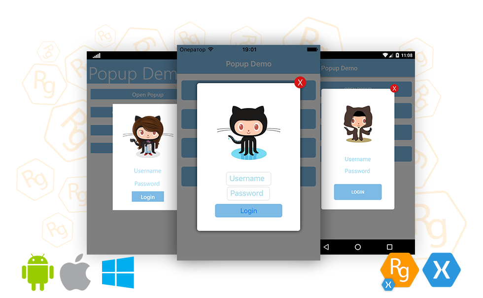

# Popup Page Plugin for Xamarin Forms 
**Rg.Plugins.Popup** - is a cross platform plugin for [Xamarin.Forms](https://www.xamarin.com/forms) which allows to open Xamarin.Forms pages as a popup that can be shared across iOS, Android and UWP (macOS supporting will be soon). Also the plugin allows to use very simple and flexible animations for showing popup pages. For more information see [Wiki](https://github.com/rotorgames/Rg.Plugins.Popup/wiki)

**Warning:** Beginning with v1.1.x you must initialize this plugin and add some code in `MainActivity` that a hardware android back button works. [See Getting Started](https://github.com/rotorgames/Rg.Plugins.Popup/wiki/Getting-started)

## Setup
* Available on NuGet: https://www.nuget.org/packages/Rg.Plugins.Popup  
* Install into your PCL project and Client projects.
* Development NuGet: https://ci.appveyor.com/nuget/rg-plugins-popup-p6l5elugev99 

## Support platforms

- [x] Android
- [x] iOS
- [x] UWP (Min Target: 10.0.17763)
- [x] Tizen
- [x] WPF
- [x] MacOS

## Documentation
You can find all descriptions of [Getting Started](https://github.com/rotorgames/Rg.Plugins.Popup/wiki/Getting-started), [How to use](https://github.com/rotorgames/Rg.Plugins.Popup/wiki/PopupPage), [Troubleshooting](https://github.com/rotorgames/Rg.Plugins.Popup/wiki/Troubleshooting) and etc in the [Wiki](https://github.com/rotorgames/Rg.Plugins.Popup/wiki)

## Created By: Kirill Lyubimov
* LinkedIn: [Kirill Lyubimov](https://www.linkedin.com/in/kirill-lyubimov-06a68712b/)
* Twitter: [@rotorgames_LK](https://twitter.com/rotorgames_LK)

## License

The MIT License

Permission is hereby granted, free of charge, to any person obtaining a copy
of this software and associated documentation files (the "Software"), to deal
in the Software without restriction, including without limitation the rights
to use, copy, modify, merge, publish, distribute, sublicense, and/or sell
copies of the Software, and to permit persons to whom the Software is
furnished to do so, subject to the following conditions:

The above copyright notice and this permission notice shall be included in
all copies or substantial portions of the Software.

THE SOFTWARE IS PROVIDED "AS IS", WITHOUT WARRANTY OF ANY KIND, EXPRESS OR
IMPLIED, INCLUDING BUT NOT LIMITED TO THE WARRANTIES OF MERCHANTABILITY,
FITNESS FOR A PARTICULAR PURPOSE AND NONINFRINGEMENT. IN NO EVENT SHALL THE
AUTHORS OR COPYRIGHT HOLDERS BE LIABLE FOR ANY CLAIM, DAMAGES OR OTHER
LIABILITY, WHETHER IN AN ACTION OF CONTRACT, TORT OR OTHERWISE, ARISING FROM,
OUT OF OR IN CONNECTION WITH THE SOFTWARE OR THE USE OR OTHER DEALINGS IN
THE SOFTWARE.
