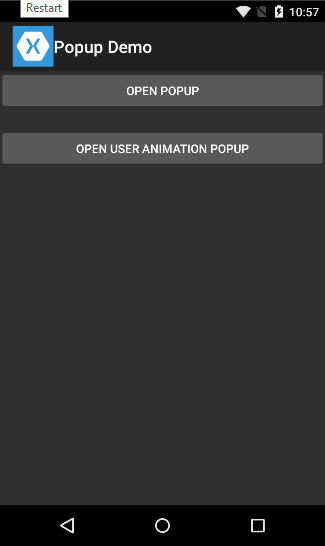
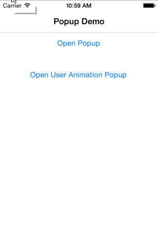

# Popup Page Plugin for Xamarin Forms
The plugin allows you to open any page as a popup.

Nuget: https://www.nuget.org/packages/Rg.Plugins.Popup/

 

## Support platforms

- [x] Android
- [x] iOS
- [ ] WP (Coming Soon)

## Support Events

* OnAppearing
* OnDisappearing
* OnBackButtonPressed

## Animations

#### Fade Animation

* Fade

#### Scale Animation

* ScaleCenterUp
* ScaleTopUp
* ScaleTopBottomUp
* ScaleBottomUp
* ScaleBottomTopUp
* ScaleLeftUp
* ScaleLeftRightUp
* ScaleRightUp
* ScaleRightLeftUp
* ScaleCenterDown
* ScaleTopDown
* ScaleTopBottomDown
* ScaleBottomDown
* ScaleBottomTopDown
* ScaleLeftDown
* ScaleLeftRightDown
* ScaleRightDown
* ScaleRightLeftDown

#### Move Animation

* MoveTop
* MoveTopBottom
* MoveBottom
* MoveBottomTop
* MoveLeft
* MoveLeftRight
* MoveRight
* MoveRightLeft

## Initialize

#### Android 

Not required

#### iOS

```csharp
public partial class AppDelegate : global::Xamarin.Forms.Platform.iOS.FormsApplicationDelegate
{
    public override bool FinishedLaunching(UIApplication app, NSDictionary options)
    {
        Rg.Plugins.Popup.IOS.Popup.Init(); // Init Popup
        
        global::Xamarin.Forms.Forms.Init();
        LoadApplication(new App());
        return base.FinishedLaunching(app, options);
    }
}
```

## PopupPage Properties

* BackgroundColor: Hex #80FF5C5C where #80 opacity [Range](http://stackoverflow.com/questions/5445085/understanding-colors-in-android-6-characters/11019879#11019879)
* IsBackgroundAnimating
* IsAnimating
* IsCloseOnBackgroundClick: Close pop-up when click on the background
* AnimationName: In default animations
* IsSystemPadding: Enabled/Disabled system padding offset (Only for Content not for Background)
	
	 
* SystemPadding: (ReadOnly) Thickness

## How Use

```xml
<?xml version="1.0" encoding="utf-8" ?>
<pages:PopupPage xmlns="http://xamarin.com/schemas/2014/forms"
             xmlns:x="http://schemas.microsoft.com/winfx/2009/xaml"
             xmlns:pages="clr-namespace:Rg.Plugins.Popup.Pages;assembly=Rg.Plugins.Popup"
             x:Class="Demo.Pages.MyPopupPage">
  <!-- Content -->
</pages:PopupPage>
```
```csharp
public partial class MyPopupPage : PopupPage
    {
        public SecondPopupPage()
        {
            InitializeComponent();
        }

        protected override void OnAppearing()
        {
            base.OnAppearing();
        }

        protected override void OnDisappearing()
        {
            base.OnDisappearing();
        }

        protected override bool OnBackButtonPressed()
        {
            // Prevent hide popup
            //return base.OnBackButtonPressed();
            return true; 
        }
    }
    
    // Main Page
    
    public partial class MainPage : ContentPage
    {
        public MainPage()
        {
            InitializeComponent();
        }
        
        // Button Click
        private async void OnOpenPupup(object sender, EventArgs e)
        {
            var page = new MyPopupPage();
            
            await Navigation.PushPopupAsync(page);
            // or
            PopupNavigation.PushAsync(page);
        }
    }
```

## User Animation

```csharp
    // User animation
    class UserAnimation : IPopupAnimation
    {
        // Call Before OnAppering
        public void Preparing(View content, PopupPage page)
        {
            // Preparing content and page
            content.Opacity = 0;
        }

		// Call After OnDisappering
        public void Disposing(View content, PopupPage page)
        {
			// Dispose Unmanaged Code
        }
        
        // Call After OnAppering
        public async Task Appearing(View content, PopupPage page)
        {
            // Show animation
            await content.FadeTo(1);
        }
        
        // Call Before OnDisappering
        public async Task Disappearing(View content, PopupPage page)
        {
            // Hide animation
            await content.FadeTo(0);
        }
    }
    
    // Popup Page
    public partial class UserPopupPage : PopupPage
    {
        public SecondPopupPage()
        {
            InitializeComponent();
            Animation = new UserAnimation();
        }
    }
```

## Thanks

* [xam-forms-transparent-modal](https://github.com/gaborv/xam-forms-transparent-modal)
